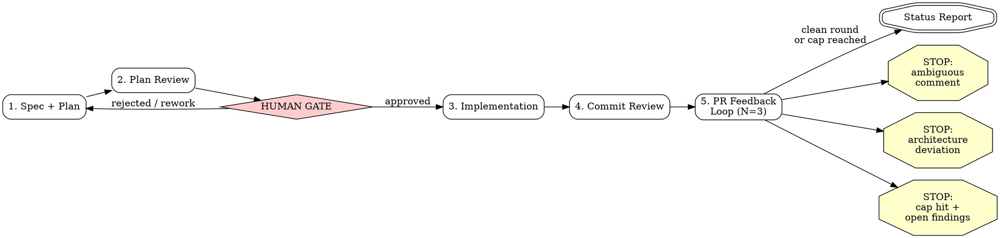

## Overview

This skill orchestrates a five-stage pipeline that takes a feature from idea (or existing spec) to a review-ready pull request. There is exactly ONE human gate: after stage 2 (plan review), before any implementation code is written. After the gate is approved, the pipeline runs autonomously to completion with exactly three exceptions (see Autonomy Contract below). The pipeline NEVER merges -- it ends with a status report.

**Stages:**

1. **Spec + Plan** -- brainstorm the design, then produce an implementation plan in house style.
2. **Plan Review** -- three-dimension review of the plan; present it to the human for approval.
3. **Implementation** -- execute the plan task-by-task via subagent-driven development.
4. **Commit Review** -- security/quality/standards review of the branch diff before push.
5. **PR Feedback Loop** -- push, open PR, address reviewer feedback for up to N rounds (default 3).

## Stage Sequence



### Stage 1: Spec + Plan

**Skip condition:** If the user provides a path to an already-approved spec or plan with a `## Pipeline State` block showing stage >= 2, skip to the indicated stage (see Resume below).

1. Invoke `superpowers:brainstorming` to explore design space, requirements, and edge cases. If a written spec already exists (user provides path or one exists at `docs/superpowers/specs/`), skip brainstorming and proceed directly to the plan.
2. Invoke `superpowers:writing-plans` to produce the implementation plan, layering the following **house plan style** on top of whatever that skill produces:

   **House plan style requirements (all four MUST be present):**

   - **File location:** `docs/superpowers/plans/YYYY-MM-DD-<topic>.md`
   - **Global Constraints preamble:** A section immediately after the Architecture block titled `## Global Constraints` that restates verbatim the binding conventions relevant to this feature, copied word-for-word from the project's conventions doc — the first agent-instructions/standards file that exists at the repo root: `AGENTS.md`, `CLAUDE.md`, `CONTRIBUTING.md`, or `STANDARDS.md`/`STYLEGUIDE.md` (follow any links a primary file makes to a detailed standards doc). Restate only the rules this feature can touch (e.g., routing/handler conventions, logging style, ORM/schema conventions, commit-message format, doc-sync requirements). Copy rules word-for-word; do not paraphrase.
   - **Verified external API section:** A section titled with the exact text `Verified external API (do not re-derive)` listing exact function signatures, type definitions, and method behaviors of any external or library APIs the plan depends on. Pin these by reading the actual source; do not guess from memory.
   - **Checkbox tasks with agentic-worker header:** Every task uses `- [ ]` checkbox syntax for step tracking. The plan MUST begin with:
     > **For agentic workers:** REQUIRED SUB-SKILL: Use superpowers:subagent-driven-development (recommended) or superpowers:executing-plans to implement this plan task-by-task.

3. After writing the plan, initialize the Pipeline State block (see below).

### Stage 2: Plan Review + Human Gate

1. Invoke `reviewing-plans` on the plan document (the three-dimension review: security, quality, standards).
2. Apply fixes from the review to the plan inline.
3. **THE GATE:** Present the reviewed plan to the human. State explicitly:

   > The plan has been reviewed (security, quality, standards). Please review and approve to proceed with implementation, or provide feedback for revision.

4. **STOP HERE. Do not write any implementation code until the human explicitly approves.** If the human requests changes, revise the plan (return to stage 1 step 2 or just edit inline), re-run the plan review, and present again.

### Stage 3: Implementation

1. Invoke `superpowers:subagent-driven-development` with the plan path. The plan's checkbox tasks and agentic-worker header guide execution.
2. Update Pipeline State after completion.

### Stage 4: Commit Review

1. Invoke `reviewing-commits` on the feature branch. This runs the project's mechanical gates (format, lint, test) then dispatches three parallel reviewers (security, quality, standards) over the branch diff, triages findings, applies fixes as commits, and re-runs gates.
2. Update Pipeline State after completion.

### Stage 5: PR Feedback Loop

1. Push the branch and open a PR (if not already open).
2. Invoke `pr-feedback-loop` with N=3 (default). This waits for the bot review, triages findings, applies fixes, replies to threads, and repeats for up to N rounds.
3. Update Pipeline State after each round.
4. When the loop terminates (clean round or cap reached), produce the final status report.

## Pipeline State

After each stage transition, update a `## Pipeline State` block in the plan document. Format:

```markdown
## Pipeline State

| Field   | Value                          |
|---------|--------------------------------|
| stage   | 3 (implementation)             |
| branch  | feat/<topic>                   |
| pr      | #<n>                           |
| round   | 0                              |
```

**Fields:**
- `stage` -- current stage number and name (e.g., `1 (spec + plan)`, `2 (plan review)`, `3 (implementation)`, `4 (commit review)`, `5 (pr feedback loop)`)
- `branch` -- the feature branch name (set at stage 3 start)
- `pr` -- the PR number (set when opened in stage 5; `n/a` before)
- `round` -- current feedback round within stage 5 (0 before stage 5)

**Resume:** On invocation, if the target plan doc already has a Pipeline State block, read it and RESUME from the indicated stage rather than starting over. For example, if stage = `4 (commit review)` and branch is set, skip stages 1-3 and begin at stage 4.

## Autonomy Contract

After the human gate (stage 2) is approved, the pipeline proceeds **without asking for permission** except in exactly three cases:

1. **Ambiguous or contentious human review comment** -- a PR reviewer's comment is unclear in intent, contradicts project conventions, or requires a judgment call that could go either way. STOP and surface the comment to the user for a decision.
2. **Architecture deviation required** -- a finding or implementation blocker requires deviating from the approved plan's architecture (not just a minor fix, but a structural change). STOP and present the deviation for approval.
3. **Round cap hit with actionable findings still open** -- the PR feedback loop reached N rounds and there are still actionable findings unresolved. STOP and report the remaining items for human decision.

Everything else proceeds autonomously. Do NOT ask "should I continue?" or "is this okay?" mid-pipeline. Do NOT ask permission to run tests, push, or open a PR. Do NOT ask whether to address a bot finding -- triage it per the pr-feedback-loop skill's criteria.

**The pipeline NEVER merges.** It ends with a status report. Merging is a human decision.

## Team Mode (experimental)

> **EXECUTED BY THE LEAD SESSION ONLY.** If you are a teammate (spawned by another session), ignore this entire section and follow only the single skill named in your spawn prompt. This section is a spawn-orchestration script for the lead; teammates never orchestrate and never advance the pipeline past the stage they own.

> **UNVALIDATED-BY-LIVE-TEAM.** Team mode ships behind the experimental agent-teams feature and has NOT been validated by a live team run. The RED/GREEN ground-truth re-run (QA-as-teammate re-reviewing a real PR diff vs. a subagent-baseline catch-rate and token cost) is a DEFERRED gate that has not been performed. Until it is, prefer the default subagent path; team mode is an explicit opt-in and is not proven to match subagent catch-rate.

Team mode reassigns the five stages above to a four-teammate agent team while keeping the lead as sole orchestrator. It does NOT change any stage's contract, gate, or the Autonomy Contract; it only changes *who* executes each stage and adds cross-teammate synchronization. Everything above this section remains the source of truth for stage behavior.

### Precondition: team-tool availability (NOT the env var)

Team mode is active **only when the team tools (SendMessage / the shared task-list tools / the teammate-spawn mechanism) are AVAILABLE** in this session. Do NOT test `CLAUDE_CODE_EXPERIMENTAL_AGENT_TEAMS` from the shell — a settings.json env var is not reliably exported into Bash, so tool availability is the only reliable in-band signal. If the team tools are ABSENT, team mode is skipped and the existing five-stage subagent flow above is the behavior **verbatim** (that is the default). A single team-tool-availability check is the branch point.

**Model/effort precondition:** at team startup, verify the teammate model IDs `claude-fable-5`, `claude-sonnet-5`, and `claude-opus-4-8[1m]` resolve and that per-teammate reasoning effort is settable. If a model ID or the effort knob is unavailable, spawn that teammate on the default model and RECORD the deviation in the Pipeline State file rather than silently failing stage 1 or 3.

### Roles (exact model IDs)

| Role | Model | Effort | Owns |
|------|-------|--------|------|
| Architect | `claude-fable-5` | high | Stage 1 (spec + plan); applies QA's plan fixes in stage 2 |
| Implementer | `claude-sonnet-5` | default | Stage 3 (implementation) + the fix-application half of stage 4 |
| QA | `claude-opus-4-8[1m]` | default | Stage 2 review dispatch/triage + stage 4 read-only review + whole-PR pre-open pass |
| Feedback | `claude-opus-4-8[1m]` | default | Stage 5 preparation (fixes + local round commit + draft replies) |

The **LEAD** is the user's main session and is fixed — it cannot be delegated to a teammate.

### Lazy spawn-timing table

Spawn each teammate as late as its stage allows (idle teammates hold context but do not burn tokens; still, deferring avoids priming on work that a gate rejection could rework):

| Teammate | Spawn at | Rationale | Retention |
|----------|----------|-----------|-----------|
| Architect | Stage 1 start (first teammate — this converts the lead session into a team) | Needed immediately for drafting | Keep idle through stage 4 so it can re-plan if an architecture-deviation exception is approved; leave idle afterward |
| QA | Stage 2 start | Not needed during drafting | Keep idle through stage 3, the stage-4 loop, and the whole-PR pre-open pass; leave idle afterward |
| Implementer | Stage 3 start — ONLY after the lead confirms the human gate is approved and passes the gate-approval token | Post-gate spawn avoids priming on a plan a gate rejection could rework | Keep idle through stage 4's review dispatch; re-activates to apply each Fix |
| Feedback | Stage 5 start — after the lead has pushed the branch and opened the PR, and hands over the PR number + initial PREV_RUN_ID | Post-open spawn avoids idle context for a stage reached much later | Leave idle after the loop terminates |

**Retention is leave-idle, never shutdown.** Terminating an individual mid-session teammate is not a verified capability; treat any "shutdown" as best-effort-if-supported. Nothing depends on it — idle teammates are cost-neutral, and Pipeline State can respawn any teammate.

### Per-role stage-boundary STOP rules

Each teammate executes ONLY its owned stage(s) and STOPS at the boundary. Teammates never advance the pipeline — **the LEAD is the sole orchestrator.**

- **As the Architect** you execute ONLY stage 1 (brainstorm-if-no-spec, then write the plan), hand the draft to the lead + QA, and STOP. You NEVER invoke `reviewing-plans`, NEVER triage or grade your own plan, and NEVER present the human gate. In stage 2 you only APPLY the specific fixes QA articulates (claim the matching shared task item, edit the plan doc, mark it done, reply to QA for verification). You re-plan only when the lead relays an approved architecture-deviation exception.
- **As the Implementer** you execute ONLY stage 3 (implementation against the APPROVED plan) plus the fix-application half of stage 4, and STOP. You must confirm the lead's `gate: approved on <date>` token before writing any code; if it is absent, refuse and ask the lead to confirm gate approval.
- **As QA** you never edit code, the plan, or any file — you dispatch fresh-context reviewer subagents, triage, ARTICULATE fixes to the author, then VERIFY. You STOP at the end of the stage-4 whole-PR pre-open pass.
- **As Feedback** you PREPARE ONLY (fixes, local round commit, draft replies) and STOP; you never push, post replies, or merge.

### Autonomy Contract in team mode

The Autonomy Contract above **binds the LEAD, not teammates.** Teammates do not decide the three exceptions — on detecting any of them (or any ambiguity), a teammate STOPS, SendMessages the LEAD, and BLOCKS until the lead acknowledges. Because SendMessage delivery is not battle-tested, the fail-safe default on non-delivery is to STALL, never to proceed. The lead is the sole human-facing router for all exceptions.

### Stage → owner map

| Stage | Owner | Notes |
|-------|-------|-------|
| 1. Spec + Plan | Architect | Drafts to the plan doc; does not self-certify, does not invoke `reviewing-plans`; STOPS and hands off to lead + QA |
| 2. Plan Review | QA dispatches + triages → Architect applies fixes | Author never grades own plan; QA reports the disposition table to the lead |
| Human gate | **Lead** | Only blocking human interaction; lead presents QA's reviewed plan, waits for approval, writes `gate_approved=true` (with date) to the Pipeline State file, passes the gate token to the Implementer |
| 3. Implementation | Implementer | subagent-driven-development against the approved plan; verifies the gate token before writing code; STOPS at boundary |
| 4. Commit Review | **QA parallel Implementer, synchronized on a quiesced tree** | QA reviews read-only + articulates; Implementer applies + commits ONE AT A TIME, signaling `commit N complete, tree quiesced` before QA reads; ends with QA's whole-PR pre-open pass |
| 5. PR Feedback Loop | Feedback prepares → **Lead** executes | Lead pushes then posts replies, updates the Pipeline State `round`, hands back `pushed round k, PREV_RUN_ID=<id>`; never merge |

### The three handoffs

1. **Stage 1 → 2 (Architect → QA):** Architect SendMessages the lead `plan drafted, ready for review`; the lead directs QA to review the plan doc.
2. **Gate → 3 (Lead → Implementer):** only after the human approves, the lead spawns the Implementer with the `gate: approved on <date>` token.
3. **Stage 4 sync (Implementer ⇄ QA):** Implementer signals `commit N complete, tree quiesced`; QA reads/reviews the quiesced tree and articulates fixes back. On convergence, QA tells the lead it is `review-ready`.

### Lead-only authorities

The lead — and only the lead — owns:

- **The single human gate.** No teammate presents or advances it. On approval the lead writes `gate_approved=true` (with date) into the Pipeline State file AND passes an explicit `gate: approved on <date>` token to the Implementer at (re)spawn. The lead confirms gate status before ANY stage-3 (re)spawn so a stale `stage` value cannot skip the gate.
- **All push and PR actions:** `git push`, `gh pr create`, and every state-changing `gh` call. Teammates prepare; the lead executes.
- **All PR thread replies,** posted using Feedback's keyed draft replies.
- **Never merges** — the pipeline never merges; only the human does, and the lead does not either (even though the lead executes pushes and PR actions).
- **The three BLOCKING autonomy exceptions.** Teammates STOP and block on detection; the lead is the sole human-facing router. The lead must acknowledge every exception flag; teammates default to STALL if no ack arrives, so the unreliable SendMessage channel fails safe.
- **Sole writer of the SEPARATE Pipeline State FILE** at `docs/superpowers/plans/<topic>.pipeline-state.md` (referenced from the plan doc). This is a DISTINCT file from the Architect-owned plan doc, so each file has exactly one writer and the durable resume artifact cannot be clobbered by a concurrent plan-doc save. The lead updates it at every stage transition and every PUSHED feedback round; the `round` field advances only after a successful push, making it the authoritative round counter and N=3 cap accounting. It carries a distinct `gate_approved` field (with date) separate from `stage`, so a respawn cannot infer gate approval from the stage number alone. (Standalone ship-feature keeps the Pipeline State block INSIDE the plan doc, unchanged; only team mode relocates it.)
- **Spawning and leave-idle** per the lazy spawn-timing table; no teammate is ever instructed to terminate another.
- **The push handback:** after each `git push`, the lead SendMessages Feedback `pushed round k, PREV_RUN_ID=<id>` so Feedback can poll for the next round; the lead enforces the N=3 cap at round advancement. Intended per-cycle order: `git push` FIRST, then post thread replies (a deliberate, documented deviation from pr-feedback-loop's standalone step-8-then-step-9 order).
- **Respawn-from-Pipeline-State on a new session:** teams are disposable — `/resume` does not restore teammates. The Pipeline State FILE is the SOLE authoritative resume artifact. The lead reads it and respawns only the teammate(s) the indicated stage needs, priming each with the plan doc, branch, PR number, and — for any stage-3+ spawn — the `gate: approved on <date>` token (refusing to spawn the Implementer if `gate_approved` is not set). Stage 2 → Architect + QA; stage 3 → Implementer; stage 4 → QA + Implementer; stage 5 → Feedback. Outstanding work is reconstructed from Pipeline State + the open PR/branch diff; the on-disk shared task list is best-effort and may be empty on respawn — never required.

### File-ownership partition

Two teammates editing the same file overwrite each other, so work is partitioned by file:

| Writer | Owns |
|--------|------|
| Architect | The plan doc file (`docs/superpowers/plans/<topic>.md`) — and nothing else |
| Lead | The separate Pipeline State file (`docs/superpowers/plans/<topic>.pipeline-state.md`) |
| Implementer | All source files + all local code commits (stage 3 and stage-4 fixes) |
| Feedback | Source files + the local round commit in stage 5 (Implementer is idle in stage 5) |
| QA and all reviewer subagents | Write NO files |

### Spawn-prompt sketches

Each teammate auto-loads ship-feature; every spawn prompt therefore names the single skill the teammate follows and repeats **"ignore this Team Mode section."**

- **Architect** — "You are the Architect teammate (model `claude-fable-5`, high effort). Team mode is active (team tools present). Execute ONLY ship-feature stage 1: `superpowers:brainstorming` (skip if a spec exists under `docs/superpowers/specs/`) then `superpowers:writing-plans` with house style (plan at `docs/superpowers/plans/YYYY-MM-DD-<topic>.md`; verbatim Global Constraints; 'Verified external API (do not re-derive)' section; checkbox tasks; agentic-worker header). You OWN only the plan doc file — never the Pipeline State file, never source. IGNORE ship-feature's '## Team Mode' section: you are a teammate, not the lead. When the plan is drafted, SendMessage the lead 'plan drafted, ready for review' and STOP — do NOT invoke `reviewing-plans`, do NOT triage/grade your own plan, do NOT present the gate. In stage 2, apply ONLY the fixes QA sends you (claim its shared task item, edit the plan, mark done, reply); QA verifies. Re-plan only if the lead relays an approved architecture-deviation. For any ambiguity/exception, STOP and SendMessage the LEAD (never the human) and block until acked."
- **Implementer** — "You are the Implementer teammate (model `claude-sonnet-5`). Team mode is active. Before anything, confirm the lead passed a `gate: approved on <date>` token and that Pipeline State shows `gate_approved=true`; if not, refuse and ask the lead to confirm — never start stage 3 on an unapproved plan. Execute ONLY ship-feature stage 3 via `superpowers:subagent-driven-development` against the approved plan, then stage-4 fixes; STOP at those boundaries. IGNORE ship-feature's '## Team Mode' section — you are a teammate, never spawn teammates or advance the pipeline. You OWN all source-file writes and all local code commits; write nothing else. Before handoff run the project's format/lint/test gates to green, then SendMessage QA 'stage 3 green, committed'. In stage 4, claim QA's fix tasks ONE AT A TIME, apply, re-run gates, commit (fixup+autosquash or conventional), SendMessage QA 'commit <sha> complete, tree quiesced', and WAIT before touching the tree again. Never push, open PRs, reply to threads, or touch Pipeline State. On any exception, STOP and SendMessage the LEAD and block until acked."
- **QA** — "You are QA, the dedicated reviewer teammate (model `claude-opus-4-8[1m]`). Team mode is active. You NEVER edit code, the plan, or any file — you dispatch fresh-context reviewer subagents (classic Agent-tool subagents, since teammates cannot spawn teammates), triage, ARTICULATE fixes to the author, then VERIFY. IGNORE ship-feature's '## Team Mode' section. Stage 2: follow `reviewing-plans`' 'Running as a team-mode teammate' note — dispatch the 3 fresh subagents, triage, SendMessage each required change to the Architect + create one shared task item, verify after it edits (re-dispatch the quality subagent if a fix touched Interfaces), report the disposition table to the lead. Stage 4: follow `reviewing-commits`' team-mode note — run gates READ-ONLY as findings; if red, articulate to the Implementer and wait for green before dispatching reviewers; run gates + branch diff ONLY on a quiesced tree (after 'commit N complete, tree quiesced'), never overlapping the Implementer's git ops; dispatch 3 fresh subagents; SendMessage each Fix to the Implementer as a shared task; verify each; loop until converged; then run the whole-PR pre-open pass and SendMessage the lead 'review-ready'. Surface architecture-deviation findings to the LEAD and block until it decides. Never push or open PRs."
- **Feedback** — "You are the Feedback teammate (model `claude-opus-4-8[1m]`). Team mode is active. IGNORE ship-feature's '## Team Mode' section — you are a teammate, never orchestrate. Follow `pr-feedback-loop`'s 'Running as a team-mode teammate' note. Setup push + `gh pr create` (lead already did these), posting replies, and `git push` are all SUSPENDED — you do NONE of them. Determine round k from the lead-maintained Pipeline State `round`, NOT git-log commit count. Wait for the bot review using the PREV_RUN_ID the lead handed you. Collect threads + human comments (read-only `gh`), triage, apply Fix changes, run the project's format/lint/test gates, create the round commit LOCALLY (`fix: address PR #<n> review round <k> — <summary>`, no trailers). SendMessage the lead ONE package: commit sha + findings-disposition table + per-thread draft replies keyed by thread/comment ID + the bot run ID you acted on — and STOP. Do NOT resume until the lead SendMessages 'pushed round k, PREV_RUN_ID=<id>'; then begin the round k+1 wait. For any of the three autonomy exceptions, STOP and SendMessage the LEAD and block until it decides. Never push, post replies, or merge."

## Red Flags

These are rationalization patterns from baseline runs. If you catch yourself thinking any of these, STOP -- you are about to violate the pipeline:

1. **"The plan is simple enough to skip review."** WRONG. Every plan gets the three-dimension review regardless of apparent simplicity. A one-flag CLI change still touches conventions (doc-sync, skill generation, test coverage) that only structured review catches.

2. **"I'll just ask the user to be safe."** WRONG. After the gate is approved, you proceed autonomously. The three exceptions above are the ONLY reasons to stop. Mid-pipeline permission-asking breaks flow and signals uncertainty that should have been resolved in planning.

3. **"PR is open, my job is done."** WRONG. Opening the PR is the START of stage 5, not the end of the pipeline. The feedback loop runs N rounds of triage-fix-push-wait. The pipeline ends with a status report after the loop terminates.

4. **"The tests pass so the code is fine."** WRONG. Passing tests prove the happy path. Stage 4 (commit review) exists precisely to catch what tests miss: security boundaries, convention violations, missing error paths, tenant isolation gaps.

5. **"I can skip brainstorming for a small feature."** ACCEPTABLE only if a written spec already exists. If no spec exists, brainstorming ensures requirements and edge cases are surfaced before planning begins -- even for small features.
