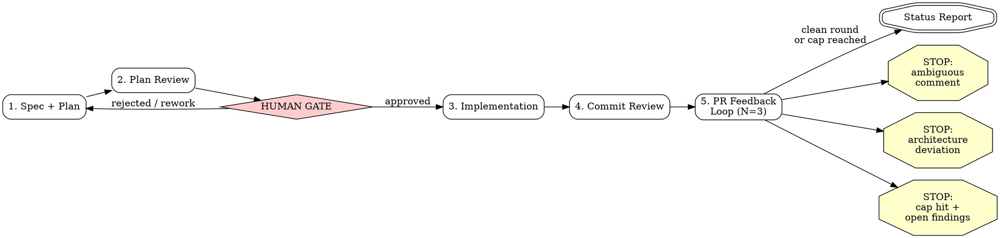

## Overview

This skill orchestrates a five-stage pipeline that takes a feature from idea (or existing spec) to a review-ready pull request. There is exactly ONE human gate: after stage 2 (plan review), before any implementation code is written. After the gate is approved, the pipeline runs autonomously to completion with exactly three exceptions (see Autonomy Contract below). The pipeline NEVER merges -- it ends with a status report.

**Stages:**

1. **Spec + Plan** -- verify the premise, brainstorm the design, then produce an implementation plan in house style.
2. **Plan Review** -- review of the plan; present it to the human for approval.
3. **Implementation** -- execute the plan; task-by-task via subagents, or inline for small changes.
4. **Commit Review** -- security/quality/standards review of the branch diff before push.
5. **PR Feedback Loop** -- push, open PR, address reviewer feedback for up to N rounds (default 3).

## Profiles: scale the pipeline to the domain

Right-Sizing (below) scales ceremony to the *weight* of a change (Small/Standard/Large). **Profiles** scale it to the *domain* — what kind of change it is. The two axes are orthogonal: every change has both a weight and a profile. "Full-stack" is not a third thing; it is the frontend and backend profiles both active on one feature, and the backend part's weight is just its right-sizing class.

A profile is a file under `profiles/` supplying three slices, each consumed by a different stage:

- **Planner slice** (stage 1) — the domain's right-sizing trigger meanings, the task shapes to author, and the per-task acceptance + `review:` tag to bake into the plan.
- **Executor slice** (stage 3) — how the mid-level executor verifies a task is done in this domain.
- **Reviewer slice** (stages 2 & 4) — the rubric dimensions the review fan-out uses.

**The profiles:**

- `profiles/backend.md` — server, data, APIs. **The default.**
- `profiles/frontend.md` — UI, client state, styling, interaction, accessibility.
- `profiles/seam.md` — a thin addendum, *also* active whenever both backend and frontend are (full-stack); it governs the client/server contract.

**Selecting the profile(s):**

1. **Pinned by entry skill** — `ship-frontend` pins `frontend`; `ship-fullstack` pins `frontend` + `backend` + `seam`. If invoked that way, use the pin and skip inference.
2. **Inferred from the change** — otherwise, use the stage-1 premise check (which surfaces/files the change touches): UI/client files → `frontend`; server/data/API files → `backend`; both → both + `seam`.
3. **Default to `backend`** when the signal is absent or ambiguous (e.g. greenfield with no files yet to detect from) — and say so in the plan, so the human can redirect before the gate.

Record the active profile(s) in Pipeline State (`profile` field) at stage 1 start, alongside `class`. **Load the active profile file(s) at the start of each stage and apply the matching slice.** When two profiles are active, apply both planner/executor/reviewer slices and add the `seam` addendum.

## Right-Sizing: scale the ceremony to the change

The five stages and the ONE human gate are invariant — every run passes through all five and stops at the gate. What scales is the *weight* of stages 2–4: a mechanical, interface-preserving change does not need the same review fan-out and subagent relay as a new subsystem or a behavioral change. Classify the change at the START of stage 1 (record the class and one-line reason in Pipeline State) and apply the matching column below. When unsure which class, pick the heavier one.

**Classify by risk, not file count.** File count is a bad proxy: renaming a config variable across 12 files is trivial, while reimplementing one file's internals is not. Score the change on three dimensions and take the *highest* it triggers. The active **profile** gives each dimension its domain-specific meaning — what counts as a "new surface" or a "risky boundary" differs for backend (a route, a migration) vs. frontend (a new screen, auth UI, an XSS sink); read the profile's planner slice for the concrete triggers.

- **New surface** — does it add a dependency, DB table/migration, public API/route, config var, or subsystem? (adds surface → at least Standard; new subsystem/schema/cross-repo contract → Large)
- **Risky boundary** — does it touch auth/authz, payments/money, data integrity, concurrency, migrations, or a security-relevant path? (yes → at least Standard, usually Large regardless of size)
- **Mechanical vs. semantic** — does correctness follow from a *uniform, interface-preserving* edit (rename, move, signature-preserving refactor, adding a flag that defaults off), or does it require *per-site reasoning about new behavior*? Mechanical → Small even across many files; semantic/behavioral → Standard+ even in one file.

File count is at most a weak tiebreaker within a dimension, never the trigger itself.

| | **Small** | **Standard** | **Large** |
|---|---|---|---|
| **Trigger** | mechanical / interface-preserving, adds no surface, touches no risky boundary — regardless of file count (e.g. rename a var across N files, move code, signature-preserving refactor, default-off flag) | adds surface OR is semantic/behavioral OR touches a risky boundary in a contained way — but no new subsystem/schema/cross-repo contract | new subsystem, schema/migration, security or money boundary, cross-repo contract, or a semantic change whose blast radius spans many consumers |
| **Stage 1 spec** | SKIP the written spec — premise check (below) is the only stage-1 gate on correctness; go straight to the plan | brainstorm → written spec | brainstorm → written spec (decompose if needed) |
| **Stage 1 brainstorm** | premise check (below) + confirm approach in-line; skip multi-question ceremony if the answers are already clear | full brainstorming | full brainstorming + decompose if needed |
| **Stage 1 plan** | lightweight plan (still house-style, but tasks may be coarse) — the plan doubles as the spec | full plan | full plan |
| **Stage 2 review** | ONE reviewer pass (combined dimensions), unless the premise check flags risk | three-dimension `reviewing-plans` | three-dimension `reviewing-plans` |
| **Stage 3** | inline execution (`superpowers:executing-plans`), no per-task subagent relay | subagent-driven (executor on `claude-sonnet-5`), batch trivial tasks; per-task reviewer only for `review: yes` tasks; skip SDD's final whole-branch review | subagent-driven, one task per subagent; per-task reviewer only for `review: yes` tasks; skip SDD's final whole-branch review |
| **Stage 4** | rely on the PR bot as the review pass; run mechanical gates + a single self-review, skip the 3-reviewer fan-out | the ONE whole-diff fan-out: profile-aware `reviewing-commits`, bounded re-reviews | the ONE whole-diff fan-out: profile-aware `reviewing-commits`, bounded re-reviews |

**Do not stack redundant review layers.** Stage-4 commit-review, subagent-driven-development's final whole-branch review, and the stage-5 PR bot largely overlap in scope. Run the full 3-reviewer fan-out **exactly once** per run at the heaviest-justified point: for Small changes the PR bot; for Standard/Large stage 4 (and therefore skip SDD's separate final review). See **Review Cadence** below for the full rule, including conditional per-task review and bounded re-reviews.

## Model Tiering: senior plans, mid executes, senior reviews

The pipeline mirrors an engineering team: an experienced engineer plans and reviews; a capable mid-level engineer executes well-defined tasks. This holds on BOTH the default (subagent) path and in team mode, and is independent of the profile.

| Work | Tier | Model |
|------|------|-------|
| Planning (stage 1), review triage, orchestration | senior | `claude-opus-4-8[1m]`, high effort |
| Per-task implementation (stage 3) | mid | `claude-sonnet-5` |
| Reviewer subagents (stages 2 & 4) | senior | `claude-opus-4-8[1m]` |

**Default path:** the orchestrating session IS the senior planner/reviewer; spawn stage-3 implementer subagents on `claude-sonnet-5` and reviewer subagents on `claude-opus-4-8[1m]`. **Always specify the model explicitly when dispatching a subagent** — an omitted model inherits the session's model and silently defeats this tiering. (This layers over subagent-driven-development's own "Model Selection" section, pinning its tiers to these concrete IDs.)

The investment is deliberately front-loaded: a well-specified plan from the senior planner is what lets a mid-level executor produce correct code without heavy per-task review (see Review Cadence). **If the executor struggles, the fix is a better-specified plan, not a more expensive executor.**

## Review Cadence: one authoritative pass; converge, don't ratchet

Reviews are the pipeline's main stall risk. Fresh-context reviews of the same diff each surface their own subjective findings, so a fix for one round's findings hands the next round a changed diff to find NEW findings in — reviews can generate work faster than they converge. This cadence keeps review value high while making the loop terminate. It binds every stage below and every profile.

1. **Per-task review is conditional.** In stage 3, only tasks the plan tags `review: yes` (planner-flagged risky tasks — see the profile's planner slice) get a per-task reviewer subagent. Mechanical/transcription tasks (`review: no`) go straight to the task's own verification (tests, or the frontend profile's render/screenshot check) — the one whole-diff fan-out still covers them. A well-specified plan makes most tasks `review: no`.
2. **Exactly ONE authoritative whole-diff fan-out per run**, at the heaviest-justified point:
   - **Standard/Large:** stage 4 `reviewing-commits` (three profile-aware reviewers). Stage 3 does NOT run subagent-driven-development's separate final whole-branch review — stage 4 is the fan-out.
   - **Small:** the stage-5 PR bot. Stage 4 is mechanical gates + one self-review only.
3. **Re-reviews are scope-bounded.** After a fix, the re-review verifies ONLY that the fix resolves its finding and introduces no regression in the touched lines. It does NOT re-scan the whole diff for new findings. This is what stops the ratchet.
4. **Stage 5 is capped at N=3**, a clean round-1 exits immediately, and the loop never blocks on slow CI (see Stage 5).

## Stage Sequence



### Stage 1: Spec + Plan

**Skip condition:** If the user provides a path to an already-approved spec or plan with a `## Pipeline State` block showing stage >= 2, skip to the indicated stage (see Resume below).

0. **Premise & blast-radius check (do this FIRST, by reading code — not assumption).** Before brainstorming design *details*, verify the design *premise*: the facts the whole change rests on. A plan built on a wrong premise passes every downstream review — three fresh reviewers will all bless a correct-looking implementation of the wrong thing, because the error is baked equally into the plan and the spec. Review layers cannot catch a shared blind spot; only checking reality up front can. Concretely, answer each of these by grepping/reading, and record the findings (with `file:line` evidence) in the spec — or, for a Small change that skips the spec, in the plan's Architecture/Global-Constraints preamble:
   - **Entry path — how is the thing I'm changing actually reached?** Who calls this endpoint/function/flag? Is there a proxy, gateway, BFF, or other indirection in front of it? (For a public/agent-facing surface: trace the real request path end-to-end, across repos.)
   - **Blast radius — what else lives on this path?** Enumerate every repo, service, and surface the change touches or that consumes its output. If the answer includes another repo, that repo is IN SCOPE for this run, not a follow-up.
   - **Existing prior art — is there a config/pattern/host I should reuse instead of inventing one?** Search for an existing variable/route/convention before adding a new one.
   - **Contradiction scan — does anything I just read contradict the user's framing or my assumption?** If the user names a URL, host, or component, verify it against the code before building on it. Surface any mismatch to the user NOW, not after the PR is open.
   - **Profile — which domain(s) does this change touch?** From the surfaces just enumerated, set the active profile(s) per the **Profiles** section: pinned by the entry skill (`ship-frontend` → frontend; `ship-fullstack` → frontend + backend + seam), else inferred from the touched files (UI/client → `frontend`, server/data/API → `backend`, both → both + `seam`), else default `backend` and say so. Record it in Pipeline State's `profile` field; load the profile file(s) and apply the **planner slice** while brainstorming and planning (domain right-sizing triggers, task shapes, per-task `review:` tags and acceptance criteria).

   If any answer is unknown after a reasonable search, that is itself a finding to surface — do not paper over it with a plausible guess. This step is cheap (minutes of grep) and is the single highest-leverage defense against a full rework.

1. Invoke `superpowers:brainstorming` to explore design space, requirements, and edge cases, informed by the step-0 findings, then write a spec. **Exception — Small changes (see Right-Sizing): skip both brainstorming and the written spec entirely** once the step-0 premise check is clean and the approach is unambiguous; the premise check is the correctness gate and the plan (next step) doubles as the spec. If a written spec already exists (user provides path or one exists at `docs/superpowers/specs/`), skip brainstorming and proceed directly to the plan — but still run the step-0 premise check against that spec. For a borderline Small/Standard change whose approach is clear but not trivial, keep brainstorming lightweight: confirm the approach in one exchange rather than running the full one-question-at-a-time ceremony.
2. Invoke `superpowers:writing-plans` to produce the implementation plan, layering the following **house plan style** on top of whatever that skill produces:

   **House plan style requirements (all five MUST be present):**

   - **File location:** `docs/superpowers/plans/YYYY-MM-DD-<topic>.md`
   - **Global Constraints preamble:** A section immediately after the Architecture block titled `## Global Constraints` that restates verbatim the binding conventions relevant to this feature, copied word-for-word from the project's conventions doc — the first agent-instructions/standards file that exists at the repo root: `AGENTS.md`, `CLAUDE.md`, `CONTRIBUTING.md`, or `STANDARDS.md`/`STYLEGUIDE.md` (follow any links a primary file makes to a detailed standards doc). Restate only the rules this feature can touch (e.g., routing/handler conventions, logging style, ORM/schema conventions, commit-message format, doc-sync requirements). Copy rules word-for-word; do not paraphrase.
   - **Verified external API section:** A section titled with the exact text `Verified external API (do not re-derive)` listing exact function signatures, type definitions, and method behaviors of any external or library APIs the plan depends on. Pin these by reading the actual source; do not guess from memory.
   - **Checkbox tasks with agentic-worker header:** Every task uses `- [ ]` checkbox syntax for step tracking. The plan MUST begin with:
     > **For agentic workers:** REQUIRED SUB-SKILL: Use superpowers:subagent-driven-development (recommended) or superpowers:executing-plans to implement this plan task-by-task.
   - **Profile-shaped tasks (per the active profile's planner slice):** author the task shapes the profile calls for (e.g. backend: migration/handler/validation; frontend: build-component/each-render-state/match-tokens/keyboard-path), and give **every task** a `review: yes|no` tag and concrete per-task **acceptance criteria** (the exact checks that prove it done — tests to pass, or for UI tasks the breakpoints to render, tokens to match, and keyboard/focus/reduced-motion checks). These acceptance criteria are what let the mid-level executor verify its own work and what the reviewers grade against. For a full-stack change, fix the API contract first (seam addendum) so both sides build to it.

3. After writing the plan, initialize the Pipeline State block (see below).

### Stage 2: Plan Review + Human Gate

1. Review the plan per the Right-Sizing class, using the **active profile's reviewer slice** to set the dimensions and dispatching reviewers on `claude-opus-4-8[1m]`: **Standard/Large** invoke `reviewing-plans` (three profile-aware reviewers — backend uses security/quality/standards; frontend substitutes a11y/responsive/design-fidelity/client-security for the backend security rubric and keeps quality/standards; full-stack runs both plus the seam's contract-consistency/error-propagation/validation-parity dimensions); **Small** run a single combined-dimension review pass (self-review against the same profile rubric, or one reviewer subagent) unless the step-0 premise check flagged risk, in which case escalate to the full `reviewing-plans`. Either way, a review of some weight always runs before the gate.
2. Apply fixes from the review to the plan inline.
3. **THE GATE:** Present the reviewed plan to the human. State explicitly:

   > The plan has been reviewed (across the active profile's dimensions — e.g. security/quality/standards for backend, or accessibility/responsive/design-fidelity/client-security for frontend). Please review and approve to proceed with implementation, or provide feedback for revision.

4. **STOP HERE. Do not write any implementation code until the human explicitly approves.** If the human requests changes, revise the plan (return to stage 1 step 2 or just edit inline), re-run the plan review, and present again.

### Stage 3: Implementation

1. Execute the plan per the Right-Sizing class, spawning implementer subagents on `claude-sonnet-5` (the mid-level executor — see Model Tiering): **Standard/Large** invoke `superpowers:subagent-driven-development` (fresh subagent per task, or batching only trivial tasks); **Small** execute inline with `superpowers:executing-plans`. Either way, follow the plan's checkbox tasks and apply the **active profile's executor slice** to verify each task (backend: TDD + gates green; frontend: run the app, drive it, screenshot at the plan's breakpoints, a11y check, gates; full-stack: also verify the seam end-to-end — real UI action → real API → real data layer).
2. Apply the **Review Cadence** to subagent-driven-development: (a) dispatch a per-task reviewer ONLY for tasks the plan tagged `review: yes` — `review: no` tasks are gated by their own acceptance criteria (tests/screenshots), not a reviewer; (b) do NOT run SDD's final whole-branch review — the single authoritative fan-out is stage 4; (c) any re-review is scope-bounded to the fix, not a fresh whole-diff pass. Dispatch the per-task reviewers on `claude-opus-4-8[1m]`.
3. Update Pipeline State after completion.

### Stage 4: Commit Review

1. This is the **one authoritative whole-diff fan-out** (see Review Cadence). Run it per the Right-Sizing class:
   - **Standard/Large:** invoke `reviewing-commits` on the feature branch — mechanical gates (format, lint, test) then three parallel **profile-aware** reviewers over the branch diff (dimensions from the active profile's reviewer slice, as in Stage 2), dispatched on `claude-opus-4-8[1m]`; triage, fix as commits, re-run gates. Re-reviews are scope-bounded to each fix, not a fresh whole-diff pass. Stage 3 skipped SDD's final review precisely so this is the single fan-out — do not look for a prior whole-branch review to dedupe against.
   - **Small:** run the project's mechanical gates + a single self-review against the profile's reviewer rubric, then rely on the stage-5 PR bot as the fan-out. Skip the 3-reviewer pass.
2. Update Pipeline State after completion.

### Stage 5: PR Feedback Loop

1. Push the branch and open a PR (if not already open).
2. Invoke `pr-feedback-loop` with N=3 (default). This waits for the bot review, triages findings, applies fixes, replies to threads, and repeats for up to N rounds.
3. Update Pipeline State after each round.
4. When the loop terminates (clean round or cap reached), produce the final status report.

**Do not block on slow CI for a clean-round exit.** The bot review that drives the feedback loop is what you wait for; long-running CI jobs (full test suites, container builds) are not. Once the loop reaches a clean round and local mechanical gates already passed in stage 4, report completion and note CI as "in progress — will report if it fails" rather than sitting in a blocking poll for multi-minute jobs. Only wait synchronously on CI when a check is *required for the exit decision* (e.g. a branch-freshness gate you must resolve, or a red check that changes your triage). Prefer backgrounding long waits over serial `sleep` loops.

## Pipeline State

After each stage transition, update a `## Pipeline State` block in the plan document. Format:

```markdown
## Pipeline State

| Field   | Value                          |
|---------|--------------------------------|
| stage   | 3 (implementation)             |
| class   | small (mechanical rename, no new surface) |
| profile | frontend                       |
| branch  | feat/<topic>                   |
| pr      | #<n>                           |
| round   | 0                              |
```

**Fields:**
- `stage` -- current stage number and name (e.g., `1 (spec + plan)`, `2 (plan review)`, `3 (implementation)`, `4 (commit review)`, `5 (pr feedback loop)`)
- `class` -- the Right-Sizing class (`small` / `standard` / `large`) plus a one-line reason, set at stage 1 start. Drives the weight of stages 2–4.
- `profile` -- the active domain profile(s): `backend` (default), `frontend`, or `frontend+backend+seam` (full-stack), set at stage 1 start. Drives which planner/executor/reviewer slices each stage applies.
- `branch` -- the feature branch name (set at stage 3 start)
- `pr` -- the PR number (set when opened in stage 5; `n/a` before)
- `round` -- current feedback round within stage 5 (0 before stage 5)

**Resume:** On invocation, if the target plan doc already has a Pipeline State block, read it and RESUME from the indicated stage rather than starting over. For example, if stage = `4 (commit review)` and branch is set, skip stages 1-3 and begin at stage 4.

## Autonomy Contract

After the human gate (stage 2) is approved, the pipeline proceeds **without asking for permission** except in exactly three cases:

1. **Ambiguous or contentious human review comment** -- a PR reviewer's comment is unclear in intent, contradicts project conventions, or requires a judgment call that could go either way. STOP and surface the comment to the user for a decision.
2. **Architecture deviation required** -- a finding or implementation blocker requires deviating from the approved plan's architecture (not just a minor fix, but a structural change). STOP and present the deviation for approval.
3. **Round cap hit with actionable findings still open** -- the PR feedback loop reached N rounds and there are still actionable findings unresolved. STOP and report the remaining items for human decision.

Everything else proceeds autonomously. Do NOT ask "should I continue?" or "is this okay?" mid-pipeline. Do NOT ask permission to run tests, push, or open a PR. Do NOT ask whether to address a bot finding -- triage it per the pr-feedback-loop skill's criteria.

**The pipeline NEVER merges.** It ends with a status report. Merging is a human decision.

## Team Mode (experimental)

> **EXECUTED BY THE LEAD SESSION ONLY.** If you are a teammate (spawned by another session), ignore this entire section and follow only the single skill named in your spawn prompt. This section is a spawn-orchestration script for the lead; teammates never orchestrate and never advance the pipeline past the stage they own.

> **UNVALIDATED-BY-LIVE-TEAM.** Team mode ships behind the experimental agent-teams feature and has NOT been validated by a live team run. The RED/GREEN ground-truth re-run (QA-as-teammate re-reviewing a real PR diff vs. a subagent-baseline catch-rate and token cost) is a DEFERRED gate that has not been performed. Until it is, prefer the default subagent path; team mode is an explicit opt-in and is not proven to match subagent catch-rate.

Team mode reassigns the five stages above to a four-teammate agent team while keeping the lead as sole orchestrator. It does NOT change any stage's contract, gate, or the Autonomy Contract; it only changes *who* executes each stage and adds cross-teammate synchronization. Everything above this section remains the source of truth for stage behavior.

### Precondition: team-tool availability (NOT the env var)

Team mode is active **only when the team tools (SendMessage / the shared task-list tools / the teammate-spawn mechanism) are AVAILABLE** in this session. Do NOT test `CLAUDE_CODE_EXPERIMENTAL_AGENT_TEAMS` from the shell — a settings.json env var is not reliably exported into Bash, so tool availability is the only reliable in-band signal. If the team tools are ABSENT, team mode is skipped and the existing five-stage subagent flow above is the behavior **verbatim** (that is the default). A single team-tool-availability check is the branch point.

**Model/effort precondition:** at team startup, verify the teammate model IDs `claude-opus-4-8[1m]` and `claude-sonnet-5` resolve and that per-teammate reasoning effort is settable. If a model ID or the effort knob is unavailable, spawn that teammate on the default model and RECORD the deviation in the Pipeline State file rather than silently failing stage 1 or 3.

### Roles (exact model IDs)

| Role | Model | Effort | Owns |
|------|-------|--------|------|
| Architect | `claude-opus-4-8[1m]` | high | Stage 1 (spec + plan); applies QA's plan fixes in stage 2 |
| Implementer | `claude-sonnet-5` | default | Stage 3 (implementation) + the fix-application half of stage 4 |
| QA | `claude-opus-4-8[1m]` | default | Stage 2 review dispatch/triage + stage 4 read-only review + whole-PR pre-open pass |
| Feedback | `claude-opus-4-8[1m]` | default | Stage 5 preparation (fixes + local round commit + draft replies) |

The **LEAD** is the user's main session and is fixed — it cannot be delegated to a teammate.

### Lazy spawn-timing table

Spawn each teammate as late as its stage allows (idle teammates hold context but do not burn tokens; still, deferring avoids priming on work that a gate rejection could rework):

| Teammate | Spawn at | Rationale | Retention |
|----------|----------|-----------|-----------|
| Architect | Stage 1 start (first teammate — this converts the lead session into a team) | Needed immediately for drafting | Keep idle through stage 4 so it can re-plan if an architecture-deviation exception is approved; leave idle afterward |
| QA | Stage 2 start | Not needed during drafting | Keep idle through stage 3, the stage-4 loop, and the whole-PR pre-open pass; leave idle afterward |
| Implementer | Stage 3 start — ONLY after the lead confirms the human gate is approved and passes the gate-approval token | Post-gate spawn avoids priming on a plan a gate rejection could rework | Keep idle through stage 4's review dispatch; re-activates to apply each Fix |
| Feedback | Stage 5 start — after the lead has pushed the branch and opened the PR, and hands over the PR number + initial PREV_RUN_ID | Post-open spawn avoids idle context for a stage reached much later | Leave idle after the loop terminates |

**Retention is leave-idle, never shutdown.** Terminating an individual mid-session teammate is not a verified capability; treat any "shutdown" as best-effort-if-supported. Nothing depends on it — idle teammates are cost-neutral, and Pipeline State can respawn any teammate.

### Per-role stage-boundary STOP rules

Each teammate executes ONLY its owned stage(s) and STOPS at the boundary. Teammates never advance the pipeline — **the LEAD is the sole orchestrator.**

- **As the Architect** you execute ONLY stage 1 (brainstorm-if-no-spec, then write the plan), hand the draft to the lead + QA, and STOP. You NEVER invoke `reviewing-plans`, NEVER triage or grade your own plan, and NEVER present the human gate. In stage 2 you only APPLY the specific fixes QA articulates (claim the matching shared task item, edit the plan doc, mark it done, reply to QA for verification). You re-plan only when the lead relays an approved architecture-deviation exception.
- **As the Implementer** you execute ONLY stage 3 (implementation against the APPROVED plan) plus the fix-application half of stage 4, and STOP. You must confirm the lead's `gate: approved on <date>` token before writing any code; if it is absent, refuse and ask the lead to confirm gate approval.
- **As QA** you never edit code, the plan, or any file — you dispatch fresh-context reviewer subagents, triage, ARTICULATE fixes to the author, then VERIFY. You STOP at the end of the stage-4 whole-PR pre-open pass.
- **As Feedback** you PREPARE ONLY (fixes, local round commit, draft replies) and STOP; you never push, post replies, or merge.

### Autonomy Contract in team mode

The Autonomy Contract above **binds the LEAD, not teammates.** Teammates do not decide the three exceptions — on detecting any of them (or any ambiguity), a teammate STOPS, SendMessages the LEAD, and BLOCKS until the lead acknowledges. Because SendMessage delivery is not battle-tested, the fail-safe default on non-delivery is to STALL, never to proceed. The lead is the sole human-facing router for all exceptions.

### Stage → owner map

| Stage | Owner | Notes |
|-------|-------|-------|
| 1. Spec + Plan | Architect | Drafts to the plan doc; does not self-certify, does not invoke `reviewing-plans`; STOPS and hands off to lead + QA |
| 2. Plan Review | QA dispatches + triages → Architect applies fixes | Author never grades own plan; QA reports the disposition table to the lead |
| Human gate | **Lead** | Only blocking human interaction; lead presents QA's reviewed plan, waits for approval, writes `gate_approved=true` (with date) to the Pipeline State file, passes the gate token to the Implementer |
| 3. Implementation | Implementer | subagent-driven-development against the approved plan; verifies the gate token before writing code; STOPS at boundary |
| 4. Commit Review | **QA parallel Implementer, synchronized on a quiesced tree** | QA reviews read-only + articulates; Implementer applies + commits ONE AT A TIME, signaling `commit N complete, tree quiesced` before QA reads; ends with QA's whole-PR pre-open pass |
| 5. PR Feedback Loop | Feedback prepares → **Lead** executes | Lead pushes then posts replies, updates the Pipeline State `round`, hands back `pushed round k, PREV_RUN_ID=<id>`; never merge |

### The three handoffs

1. **Stage 1 → 2 (Architect → QA):** Architect SendMessages the lead `plan drafted, ready for review`; the lead directs QA to review the plan doc.
2. **Gate → 3 (Lead → Implementer):** only after the human approves, the lead spawns the Implementer with the `gate: approved on <date>` token.
3. **Stage 4 sync (Implementer ⇄ QA):** Implementer signals `commit N complete, tree quiesced`; QA reads/reviews the quiesced tree and articulates fixes back. On convergence, QA tells the lead it is `review-ready`.

### Lead-only authorities

The lead — and only the lead — owns:

- **The single human gate.** No teammate presents or advances it. On approval the lead writes `gate_approved=true` (with date) into the Pipeline State file AND passes an explicit `gate: approved on <date>` token to the Implementer at (re)spawn. The lead confirms gate status before ANY stage-3 (re)spawn so a stale `stage` value cannot skip the gate.
- **All push and PR actions:** `git push`, `gh pr create`, and every state-changing `gh` call. Teammates prepare; the lead executes.
- **All PR thread replies,** posted using Feedback's keyed draft replies.
- **Never merges** — the pipeline never merges; only the human does, and the lead does not either (even though the lead executes pushes and PR actions).
- **The three BLOCKING autonomy exceptions.** Teammates STOP and block on detection; the lead is the sole human-facing router. The lead must acknowledge every exception flag; teammates default to STALL if no ack arrives, so the unreliable SendMessage channel fails safe.
- **Sole writer of the SEPARATE Pipeline State FILE** at `docs/superpowers/plans/<topic>.pipeline-state.md` (referenced from the plan doc). This is a DISTINCT file from the Architect-owned plan doc, so each file has exactly one writer and the durable resume artifact cannot be clobbered by a concurrent plan-doc save. The lead updates it at every stage transition and every PUSHED feedback round; the `round` field advances only after a successful push, making it the authoritative round counter and N=3 cap accounting. It carries a distinct `gate_approved` field (with date) separate from `stage`, so a respawn cannot infer gate approval from the stage number alone. (Standalone ship-feature keeps the Pipeline State block INSIDE the plan doc, unchanged; only team mode relocates it.)
- **Spawning and leave-idle** per the lazy spawn-timing table; no teammate is ever instructed to terminate another.
- **The push handback:** after each `git push`, the lead SendMessages Feedback `pushed round k, PREV_RUN_ID=<id>` so Feedback can poll for the next round; the lead enforces the N=3 cap at round advancement. Intended per-cycle order: `git push` FIRST, then post thread replies (a deliberate, documented deviation from pr-feedback-loop's standalone step-8-then-step-9 order).
- **Respawn-from-Pipeline-State on a new session:** teams are disposable — `/resume` does not restore teammates. The Pipeline State FILE is the SOLE authoritative resume artifact. The lead reads it and respawns only the teammate(s) the indicated stage needs, priming each with the plan doc, branch, PR number, and — for any stage-3+ spawn — the `gate: approved on <date>` token (refusing to spawn the Implementer if `gate_approved` is not set). Stage 2 → Architect + QA; stage 3 → Implementer; stage 4 → QA + Implementer; stage 5 → Feedback. Outstanding work is reconstructed from Pipeline State + the open PR/branch diff; the on-disk shared task list is best-effort and may be empty on respawn — never required.

### File-ownership partition

Two teammates editing the same file overwrite each other, so work is partitioned by file:

| Writer | Owns |
|--------|------|
| Architect | The plan doc file (`docs/superpowers/plans/<topic>.md`) — and nothing else |
| Lead | The separate Pipeline State file (`docs/superpowers/plans/<topic>.pipeline-state.md`) |
| Implementer | All source files + all local code commits (stage 3 and stage-4 fixes) |
| Feedback | Source files + the local round commit in stage 5 (Implementer is idle in stage 5) |
| QA and all reviewer subagents | Write NO files |

### Spawn-prompt sketches

Each teammate auto-loads ship-feature; every spawn prompt therefore names the single skill the teammate follows and repeats **"ignore this Team Mode section."** Each spawn prompt must ALSO state the active **profile(s)** (from Pipeline State) so the teammate applies the matching slice for its stage — the Architect the planner slice, the Implementer the executor slice, QA the reviewer slice. Model tiering (Architect/reviewers on `claude-opus-4-8[1m]`, Implementer on `claude-sonnet-5`) and the Review Cadence bind teammates exactly as they bind the default path.

- **Architect** — "You are the Architect teammate (model `claude-opus-4-8[1m]`, high effort). Team mode is active (team tools present). Execute ONLY ship-feature stage 1: `superpowers:brainstorming` (skip if a spec exists under `docs/superpowers/specs/`) then `superpowers:writing-plans` with house style (plan at `docs/superpowers/plans/YYYY-MM-DD-<topic>.md`; verbatim Global Constraints; 'Verified external API (do not re-derive)' section; checkbox tasks; agentic-worker header). You OWN only the plan doc file — never the Pipeline State file, never source. IGNORE ship-feature's '## Team Mode' section: you are a teammate, not the lead. When the plan is drafted, SendMessage the lead 'plan drafted, ready for review' and STOP — do NOT invoke `reviewing-plans`, do NOT triage/grade your own plan, do NOT present the gate. In stage 2, apply ONLY the fixes QA sends you (claim its shared task item, edit the plan, mark done, reply); QA verifies. Re-plan only if the lead relays an approved architecture-deviation. For any ambiguity/exception, STOP and SendMessage the LEAD (never the human) and block until acked."
- **Implementer** — "You are the Implementer teammate (model `claude-sonnet-5`). Team mode is active. Before anything, confirm the lead passed a `gate: approved on <date>` token and that Pipeline State shows `gate_approved=true`; if not, refuse and ask the lead to confirm — never start stage 3 on an unapproved plan. Execute ONLY ship-feature stage 3 via `superpowers:subagent-driven-development` against the approved plan, then stage-4 fixes; STOP at those boundaries. IGNORE ship-feature's '## Team Mode' section — you are a teammate, never spawn teammates or advance the pipeline. You OWN all source-file writes and all local code commits; write nothing else. Before handoff run the project's format/lint/test gates to green, then SendMessage QA 'stage 3 green, committed'. In stage 4, claim QA's fix tasks ONE AT A TIME, apply, re-run gates, commit (fixup+autosquash or conventional), SendMessage QA 'commit <sha> complete, tree quiesced', and WAIT before touching the tree again. Never push, open PRs, reply to threads, or touch Pipeline State. On any exception, STOP and SendMessage the LEAD and block until acked."
- **QA** — "You are QA, the dedicated reviewer teammate (model `claude-opus-4-8[1m]`). Team mode is active. You NEVER edit code, the plan, or any file — you dispatch fresh-context reviewer subagents (classic Agent-tool subagents, since teammates cannot spawn teammates), triage, ARTICULATE fixes to the author, then VERIFY. IGNORE ship-feature's '## Team Mode' section. Stage 2: follow `reviewing-plans`' 'Running as a team-mode teammate' note — dispatch the 3 fresh subagents, triage, SendMessage each required change to the Architect + create one shared task item, verify after it edits (re-dispatch the quality subagent if a fix touched Interfaces), report the disposition table to the lead. Stage 4: follow `reviewing-commits`' team-mode note — run gates READ-ONLY as findings; if red, articulate to the Implementer and wait for green before dispatching reviewers; run gates + branch diff ONLY on a quiesced tree (after 'commit N complete, tree quiesced'), never overlapping the Implementer's git ops; dispatch 3 fresh subagents; SendMessage each Fix to the Implementer as a shared task; verify each; loop until converged; then run the whole-PR pre-open pass and SendMessage the lead 'review-ready'. Surface architecture-deviation findings to the LEAD and block until it decides. Never push or open PRs."
- **Feedback** — "You are the Feedback teammate (model `claude-opus-4-8[1m]`). Team mode is active. IGNORE ship-feature's '## Team Mode' section — you are a teammate, never orchestrate. Follow `pr-feedback-loop`'s 'Running as a team-mode teammate' note. Setup push + `gh pr create` (lead already did these), posting replies, and `git push` are all SUSPENDED — you do NONE of them. Determine round k from the lead-maintained Pipeline State `round`, NOT git-log commit count. Wait for the bot review using the PREV_RUN_ID the lead handed you. Collect threads + human comments (read-only `gh`), triage, apply Fix changes, run the project's format/lint/test gates, create the round commit LOCALLY (`fix: address PR #<n> review round <k> — <summary>`, no trailers). SendMessage the lead ONE package: commit sha + findings-disposition table + per-thread draft replies keyed by thread/comment ID + the bot run ID you acted on — and STOP. Do NOT resume until the lead SendMessages 'pushed round k, PREV_RUN_ID=<id>'; then begin the round k+1 wait. For any of the three autonomy exceptions, STOP and SendMessage the LEAD and block until it decides. Never push, post replies, or merge."

## Red Flags

These are rationalization patterns from baseline runs. If you catch yourself thinking any of these, STOP -- you are about to violate the pipeline:

1. **"The plan is simple enough to skip review."** WRONG. Every plan gets a review before the gate, regardless of apparent simplicity — a one-flag CLI change still touches conventions (doc-sync, skill generation, test coverage) that only structured review catches. Right-Sizing scales the *weight* of that review (a Small change gets one combined pass instead of three), but it never scales the review to *zero*, and it never removes the human gate. "Skip" and "right-size" are different: you may right-size, you may never skip.

6. **"This is a small change, so I can skip the premise check."** WRONG — backwards. The premise check (stage 1 step 0) is MOST valuable on changes that look small, because a small-looking change built on a wrong assumption (wrong host, unseen proxy, wrong entry path) produces a fast, confident, and completely wrong PR that every review layer then blesses. Minutes of grep up front beats a full rework. Never skip it.

7. **"I'll wait for CI to be fully green before reporting."** WRONG for a clean-round exit. Wait for the *bot review* (it drives the loop) and for any check *required for the exit decision*; do not sit in a blocking poll for multi-minute test/build jobs when local gates already passed. Report completion and flag CI as in-progress. (See Stage 5.)

2. **"I'll just ask the user to be safe."** WRONG. After the gate is approved, you proceed autonomously. The three exceptions above are the ONLY reasons to stop. Mid-pipeline permission-asking breaks flow and signals uncertainty that should have been resolved in planning.

3. **"PR is open, my job is done."** WRONG. Opening the PR is the START of stage 5, not the end of the pipeline. The feedback loop runs N rounds of triage-fix-push-wait. The pipeline ends with a status report after the loop terminates.

4. **"The tests pass so the code is fine."** WRONG. Passing tests prove the happy path. Stage 4 (commit review) exists precisely to catch what tests miss: security boundaries, convention violations, missing error paths, and the active profile's domain risks (tenant-isolation gaps for backend; keyboard/focus a11y gaps and XSS sinks for frontend; contract drift across the seam for full-stack).

5. **"I can skip brainstorming and the spec for a small feature."** ACCEPTABLE for a Small change (see Right-Sizing) once the stage-1 step-0 premise check is clean and the approach is unambiguous — go straight to the plan, which doubles as the spec. ALSO acceptable if a written spec already exists. But note what you may NOT skip: the premise check is never optional (Red Flag #6), the plan is never skipped, and the human gate never goes away. For Standard/Large changes with no existing spec, brainstorming + a written spec still run — they surface requirements and edge cases before planning.

8. **"I'll review every task / re-scan the whole diff to be thorough."** WRONG — this is the stall the Review Cadence exists to prevent. A `review: no` task is gated by its own acceptance criteria (tests/screenshots), not a per-task reviewer; a re-review verifies only the fix, not the whole diff again. Thoroughness comes from ONE good whole-diff fan-out plus a well-specified plan, not from stacking fresh reviews that each invent new subjective findings. If you feel a task needs its own reviewer, the fix is to tag it `review: yes` in the plan — decided by the senior planner up front, not improvised mid-execution. (This is the mirror of Red Flag #1: you may never skip review, and you may never let it ratchet.)
