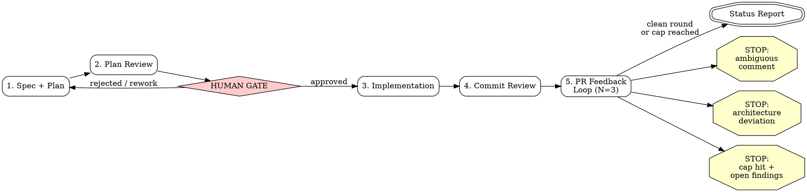

## Overview

A five-stage pipeline taking a feature from idea (or an existing spec) to a review-ready pull
request. There is exactly ONE human gate: after stage 2 (plan review), before any
implementation code is written. After the gate, the pipeline runs autonomously to completion
with the exceptions in the Autonomy Contract. **It never merges** — it ends with a status report.

**Scope: repo mode.** The spec and plan are committed as files under `docs/superpowers/` and
published on a **draft PR**. All human interaction — clarifying questions and the gate — happens
in the CLI.

**If a GitHub issue is driving the work, do not use this skill.** Use `plan-feature` (planning →
human gate) and then `build-feature` (execution → review-ready PR). Those two coordinate through
the issue and its `status:*` labels, keep the spec and plan as issue comments, and sync design
assets before the gate. This skill has no issue mode.

Shared reference — **read these at the paths below**; do not redefine their contents here:

- `~/.claude/skills/feature-pipeline/conventions.md` — profiles, right-sizing, model tiering,
  review cadence, repos without a review bot, owner notifications
- `~/.claude/skills/feature-pipeline/profiles/{backend,frontend,seam}.md` — per-domain slices

**Stages:**

1. **Spec + Plan** — verify the premise, brainstorm, write the plan in house style, commit it
   and open a draft PR.
2. **Plan Review** — review the plan; present it to the human for approval.
3. **Implementation** — execute the plan; subagents per task, or inline for small changes.
4. **Commit Review** — the one whole-diff review before push.
5. **PR Feedback Loop** — mark the draft ready, then address reviewer feedback for up to N rounds.

Profiles, Right-Sizing, Model Tiering, and the Review Cadence all come from `conventions.md`.
Select the profile per that file — or take the pin from the entry skill (`ship-frontend` →
`frontend`; `ship-fullstack` → `frontend` + `backend` + `seam`) and skip inference.

## Stage sequence



### Stage 1: Spec + Plan

**Skip condition:** if the user provides a path to an approved spec or plan whose
`## Pipeline State` block shows stage >= 2, skip to the indicated stage (see Resume).

**0. Premise & blast-radius check — do this FIRST, by reading code, not assumption.** A plan
built on a wrong premise passes every downstream review: three fresh reviewers will all bless a
correct-looking implementation of the wrong thing, because the error is baked equally into the
plan and the spec. Review layers cannot catch a shared blind spot; only checking reality up
front can. Answer each by grepping/reading and record the findings with `file:line` evidence in
the spec (or, for a Small change that skips the spec, in the plan's Global Constraints preamble):

- **Entry path** — how is the thing I'm changing actually reached? Who calls this
  endpoint/function/flag? Is there a proxy, gateway, BFF, or other indirection in front of it?
- **Blast radius** — what else lives on this path? Enumerate every repo, service, and surface the
  change touches or that consumes its output. If the answer includes another repo, that repo is
  IN SCOPE for this run, not a follow-up.
- **Prior art** — is there an existing config/pattern/host to reuse instead of inventing one?
- **Contradiction scan** — does anything I just read contradict the user's framing? If the user
  names a URL, host, or component, verify it against the code NOW, not after the PR is open.
- **Profile + class** — set the active profile(s) and the Right-Sizing class per
  `conventions.md`, and record both in Pipeline State with a one-line reason.

If any answer is unknown after a reasonable search, that is itself a finding — surface it, do not
paper over it with a plausible guess. This step is cheap and is the single highest-leverage
defense against a full rework.

**1. Brainstorm + spec.** Invoke `superpowers:brainstorming` to explore design space,
requirements, and edge cases, informed by the step-0 findings, then write a spec in **Simplified
Technical English (ASD-STE100)** — see the writing-style section in `conventions.md`.
**Small changes:** skip both brainstorming and the written spec once the premise check is clean
and the approach is unambiguous — the plan doubles as the spec. If a spec already exists (user
provides a path, or one exists at `docs/superpowers/specs/`), skip brainstorming and go to the
plan — but still run the premise check against it. For a borderline Small/Standard change whose
approach is clear but not trivial, confirm the approach in one exchange rather than the full
one-question-at-a-time ceremony.

**2. Write the plan.** Invoke `superpowers:writing-plans`, layering the **house plan style** on
top. Write all plan prose in **Simplified Technical English (ASD-STE100)** — see the
writing-style section in `conventions.md`. All five structural requirements below MUST be present:

- **File location:** `docs/superpowers/plans/YYYY-MM-DD-<topic>.md`.
- **Global Constraints preamble:** immediately after the Architecture block, a
  `## Global Constraints` section **citing** the binding conventions this feature can touch — one
  line per rule: its name, where it is enforced, and a link. Do NOT copy their text.

  The conventions doc (the first that exists at the repo root: `AGENTS.md`, `CLAUDE.md`,
  `CONTRIBUTING.md`, `STANDARDS.md`/`STYLEGUIDE.md`) is already loaded into every agent session in
  that repo, executors included, so reproducing it in the plan duplicates what the reader already
  has — and pays for it again on every execution run. The value of this section is the
  **selection**: which rules bite for THIS change. Two exceptions still quote verbatim: a rule the
  plan deliberately departs from, and a rule whose exact wording the change contests.

  **A constraint that would be identical in the next plan is not plan content.** If it is missing
  from the conventions doc, say so and recommend adding it there — do not compensate by pasting it
  into every plan.
- **`Verified external API (do not re-derive)`** — a section with that exact title listing exact
  signatures, types, and behaviors of external/library APIs the plan depends on. Pin these by
  reading actual source, never from memory.

  Scope it to facts **specific to this change**. A fact that outlives it and will be re-derived by
  the next plan belongs in the repo as dated, sourced reference material; cite it as `path:line`
  here instead of restating it.
- **Checkbox tasks with agentic-worker header:** every task uses `- [ ]`, and the plan begins
  with:
  > **For agentic workers:** REQUIRED SUB-SKILL: Use superpowers:subagent-driven-development
  > (recommended) or superpowers:executing-plans to implement this plan task-by-task.
- **Profile-shaped tasks** per the active profile's planner slice, each with a `review: yes|no`
  tag and concrete **acceptance criteria** — the exact checks that prove it done (tests to pass;
  for UI tasks the breakpoints to render, tokens to match, and keyboard/focus/reduced-motion
  checks). These criteria are what let a mid-level executor verify its own work and what
  reviewers grade against. For a full-stack change, fix the API contract first (seam addendum) so
  both sides build to it.

**3. Initialize the Pipeline State block** (see below).

**4. Publish for review.** Create the feature branch at the START of stage 1, as soon as the
premise check has fixed the topic. As each artifact is produced: commit the spec
(`docs: <topic> spec`), `git push -u origin <branch>`, and open a **draft** PR against the
default branch (`gh pr create --draft --title "<type>: <topic>" --body "spec/plan under review;
implementation follows after the human gate"`); then commit the plan (`docs: <topic> plan`) and
push. For a Small change the plan is the first artifact and is what opens the draft PR. Record
branch + PR number in Pipeline State. If the repo has no GitHub remote, commit locally and skip
the draft PR.

The draft PR does **not** start the stage-5 feedback loop and does **not** replace the human
gate. Bot or human comments on it are inputs to the **stage-2** plan review and the gate, not
stage-5 rounds. It stays a draft until stage 5.

### Stage 2: Plan Review + Human Gate

1. Review the plan per the Right-Sizing class, using the active profile's **reviewer slice** for
   dimensions, with reviewers on `claude-opus-5`: **Standard/Large** invoke `reviewing-plans`;
   **Small** run one combined-dimension pass, unless the premise check flagged risk, in which
   case escalate to the full `reviewing-plans`. A review of some weight always runs before the
   gate.
2. Apply the review's fixes to the plan inline.
3. **THE GATE.** Present the reviewed plan to the human in the CLI:

   > The plan has been reviewed across the active profile's dimensions. Please review and approve
   > to proceed with implementation, or provide feedback for revision.

4. **STOP. Write no implementation code until the human explicitly approves.** If the human
   requests changes, revise the plan, re-run the review, and present again.
5. On approval, record it in Pipeline State (`gate: approved <date>`) and proceed to stage 3. The
   approved plan on the draft PR is the durable signal.

### Stage 3: Implementation

1. Execute the plan per the Right-Sizing class, spawning implementer subagents on
   `claude-sonnet-5`: **Standard/Large** invoke `superpowers:subagent-driven-development` (fresh
   subagent per task, batching only trivial tasks); **Small** execute inline with
   `superpowers:executing-plans`. Either way, follow the plan's checkbox tasks and apply the
   profile's **executor slice** to verify each — backend: TDD + gates green; frontend: run the
   app, drive it, screenshot at the plan's breakpoints, a11y check, gates; full-stack: also
   verify the seam end-to-end (real UI action → real API → real data layer).
2. Apply the **Review Cadence**: dispatch a per-task reviewer (on `claude-opus-5`) ONLY for tasks
   tagged `review: yes`; `review: no` tasks are gated by their own acceptance criteria. Do NOT
   run subagent-driven-development's final whole-branch review — stage 4 is the single fan-out.
   Any re-review is scope-bounded to the fix.
3. Update Pipeline State.

### Stage 4: Commit Review

1. This is the **one authoritative whole-diff fan-out**:
   - **Standard/Large:** invoke `reviewing-commits` on the feature branch — mechanical gates
     (format, lint, test), then three parallel **profile-aware** reviewers over the branch diff on
     `claude-opus-5`; triage, fix as commits, re-run gates. Re-reviews are scope-bounded. Stage 3
     skipped SDD's final review precisely so this is the single fan-out — do not look for a prior
     whole-branch review to dedupe against.
   - **Small:** mechanical gates plus a single self-review against the profile's reviewer rubric.
2. **Check whether this repo has a PR review bot** before settling on the lighter path — see
   `conventions.md`. Where there is no bot, "the bot will catch it" is not available as a reason
   to review less: run the fan-out, or at minimum gates plus a genuine self-review. Never leave a
   diff with no review at all.
3. Update Pipeline State.

### Stage 5: PR Feedback Loop

1. **Ready the PR.** The draft already exists from stage 1: push the implementation + stage-4
   commits, update the PR body to the full description (format:
   `~/.claude/commands/generate-pr-description.md`), mark it ready (`gh pr ready <n>`), assign
   `@seanmcgary` (`gh pr edit <n> --add-assignee seanmcgary`), and @-mention him in the
   ready-for-review note. Fall back to `gh pr create` only if no PR exists (a no-remote run that
   skipped the stage-1 draft).
2. Invoke `pr-feedback-loop` with N=3. It waits for review, triages findings, applies fixes,
   replies to threads, and repeats for up to N rounds. (It sees the PR already open and skips its
   own create-PR setup; the `docs:` spec/plan commits do not match its round-counter grep, so
   round numbering is unaffected.)
3. Update Pipeline State after each round.
4. On termination (clean round or cap), produce the final status report.

**Do not block on slow CI for a clean-round exit.** Wait for what actually drives the loop and
for any check *required for the exit decision* (a branch-freshness gate, a red check that changes
your triage); do not sit in a blocking poll for multi-minute test/build jobs when local gates
already passed. Report completion and flag CI as in-progress. In a repo with **no review bot**,
the only signals are CI status and human comments — never poll for a review that will not arrive.

## Pipeline State

After each stage transition, update a `## Pipeline State` block in the plan document:

```markdown
## Pipeline State

| Field   | Value                                     |
|---------|-------------------------------------------|
| stage   | 3 (implementation)                        |
| class   | small (mechanical rename, no new surface)  |
| profile | frontend                                  |
| branch  | feat/<topic>                              |
| pr      | #<n>                                      |
| gate    | approved 2026-07-29                       |
| round   | 0                                         |
```

- **`stage`** — current stage number and name.
- **`class`** — Right-Sizing class plus a one-line reason, set at stage 1 start.
- **`profile`** — active domain profile(s), set at stage 1 start.
- **`branch`** — the feature branch, created at stage 1 start so the draft PR can be opened.
- **`pr`** — the PR number: opened as a DRAFT in stage 1 carrying the spec/plan, marked ready in
  stage 5. `n/a` only before the first artifact is pushed, or on a no-remote run.
- **`gate`** — `pending`, or `approved <date>` once the human approves at stage 2. A respawn must
  never infer approval from the stage number alone.
- **`round`** — current feedback round within stage 5 (`0` before stage 5).

**Resume:** on invocation, if the plan doc already has a Pipeline State block, read it and resume
from the indicated stage rather than starting over. Never resume into stage 3+ unless `gate`
shows approved.

## Autonomy Contract

After the gate, proceed **without asking permission** except in exactly three cases:

1. **Ambiguous or contentious review comment** — unclear in intent, contradicts project
   conventions, or requires a judgment call that could go either way. STOP and surface it.
2. **Architecture deviation required** — a finding or blocker requires deviating from the
   approved plan's architecture (structural, not a minor fix). STOP and present it for approval.
3. **Round cap hit with actionable findings still open.** STOP and report the remaining items.

Everything else proceeds autonomously. Do NOT ask "should I continue?" Do NOT ask permission to
run tests, push, or open a PR. Do NOT ask whether to address a finding — triage it per
`pr-feedback-loop`'s criteria.

**The pipeline NEVER merges.** It ends with a status report. Merging is a human decision.

## Red Flags

1. **"The plan is simple enough to skip review."** Wrong. Every plan gets a review before the
   gate. Right-Sizing scales the review's *weight* — a Small change gets one combined pass
   instead of three — but never to zero, and it never removes the gate. You may right-size; you
   may never skip.
2. **"This is a small change, so I can skip the premise check."** Backwards. The premise check is
   MOST valuable on changes that look small: a small-looking change built on a wrong assumption
   produces a fast, confident, completely wrong PR that every review layer then blesses.
3. **"I'll just ask the user to be safe."** After the gate you proceed autonomously. The three
   exceptions are the only reasons to stop.
4. **"I can skip brainstorming and the spec for a small feature."** Acceptable for a Small change
   once the premise check is clean, or if a spec already exists. But the premise check is never
   optional, the plan is never skipped, and the gate never goes away.
5. **"The draft PR is open, so I can start implementing (or mark it ready)."** Wrong. The stage-1
   draft only exposes the spec/plan for review — it is NOT gate approval. Implementation waits
   for the explicit gate, and the PR stays a draft until stage 5.
6. **"The tests pass so the code is fine."** Passing tests prove the happy path. Stage 4 exists
   to catch what tests miss: security boundaries, convention violations, missing error paths, and
   the profile's domain risks (tenant isolation; keyboard/focus a11y and XSS sinks; contract
   drift across the seam).
7. **"I'll review every task / re-scan the whole diff to be thorough."** This is the stall the
   Review Cadence prevents. A `review: no` task is gated by its acceptance criteria; a re-review
   verifies only the fix. If a task needs its own reviewer, tag it `review: yes` **in the plan** —
   decided up front, not improvised mid-execution.
8. **"PR is open, my job is done."** Opening the PR starts stage 5; the pipeline ends with a
   status report after the loop terminates.
9. **"I'll wait for CI to be fully green before reporting."** Wrong for a clean-round exit. Wait
   for what drives the loop and for any check required for the exit decision; report completion
   with CI flagged in-progress.
10. **"There's a GitHub issue, I'll just use issue mode."** This skill has no issue mode. Use
    `plan-feature` then `build-feature`.
