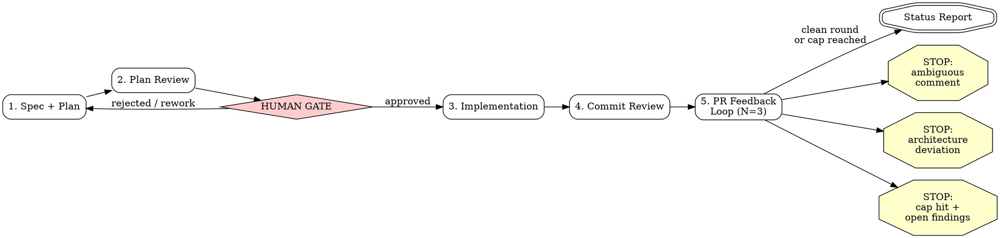

## Overview

This skill orchestrates a five-stage pipeline that takes a feature from idea (or existing spec) to a review-ready pull request. There is exactly ONE human gate: after stage 2 (plan review), before any implementation code is written. After the gate is approved, the pipeline runs autonomously to completion with exactly three exceptions (see Autonomy Contract below). The pipeline NEVER merges -- it ends with a status report.

**Stages:**

1. **Spec + Plan** -- brainstorm the design, then produce an implementation plan in house style.
2. **Plan Review** -- three-dimension review of the plan; present it to the human for approval.
3. **Implementation** -- execute the plan task-by-task via subagent-driven development.
4. **Commit Review** -- security/quality/standards review of the branch diff before push.
5. **PR Feedback Loop** -- push, open PR, address reviewer feedback for up to N rounds (default 3).

## Stage Sequence



### Stage 1: Spec + Plan

**Skip condition:** If the user provides a path to an already-approved spec or plan with a `## Pipeline State` block showing stage >= 2, skip to the indicated stage (see Resume below).

1. Invoke `superpowers:brainstorming` to explore design space, requirements, and edge cases. If a written spec already exists (user provides path or one exists at `docs/superpowers/specs/`), skip brainstorming and proceed directly to the plan.
2. Invoke `superpowers:writing-plans` to produce the implementation plan, layering the following **house plan style** on top of whatever that skill produces:

   **House plan style requirements (all four MUST be present):**

   - **File location:** `docs/superpowers/plans/YYYY-MM-DD-<topic>.md`
   - **Global Constraints preamble:** A section immediately after the Architecture block titled `## Global Constraints` that restates verbatim the binding CLAUDE.md conventions relevant to this feature (protobuf-only routes, logging style, GORM tags, commit message format, CLI doc-sync, etc.). Copy rules word-for-word from CLAUDE.md; do not paraphrase.
   - **Verified external API section:** A section titled with the exact text `Verified external API (do not re-derive)` listing exact function signatures, type definitions, and method behaviors of any external or library APIs the plan depends on. Pin these by reading the actual source; do not guess from memory.
   - **Checkbox tasks with agentic-worker header:** Every task uses `- [ ]` checkbox syntax for step tracking. The plan MUST begin with:
     > **For agentic workers:** REQUIRED SUB-SKILL: Use superpowers:subagent-driven-development (recommended) or superpowers:executing-plans to implement this plan task-by-task.

3. After writing the plan, initialize the Pipeline State block (see below).

### Stage 2: Plan Review + Human Gate

1. Invoke `reviewing-plans` on the plan document (the three-dimension review: security, quality, standards).
2. Apply fixes from the review to the plan inline.
3. **THE GATE:** Present the reviewed plan to the human. State explicitly:

   > The plan has been reviewed (security, quality, standards). Please review and approve to proceed with implementation, or provide feedback for revision.

4. **STOP HERE. Do not write any implementation code until the human explicitly approves.** If the human requests changes, revise the plan (return to stage 1 step 2 or just edit inline), re-run the plan review, and present again.

### Stage 3: Implementation

1. Invoke `superpowers:subagent-driven-development` with the plan path. The plan's checkbox tasks and agentic-worker header guide execution.
2. Update Pipeline State after completion.

### Stage 4: Commit Review

1. Invoke `reviewing-commits` on the feature branch. This runs mechanical gates (fmt, lint, test) then dispatches three parallel reviewers (security, quality, standards) over the branch diff, triages findings, applies fixes as commits, and re-runs gates.
2. Update Pipeline State after completion.

### Stage 5: PR Feedback Loop

1. Push the branch and open a PR (if not already open).
2. Invoke `pr-feedback-loop` with N=3 (default). This waits for the bot review, triages findings, applies fixes, replies to threads, and repeats for up to N rounds.
3. Update Pipeline State after each round.
4. When the loop terminates (clean round or cap reached), produce the final status report.

## Pipeline State

After each stage transition, update a `## Pipeline State` block in the plan document. Format:

```markdown
## Pipeline State

| Field   | Value                          |
|---------|--------------------------------|
| stage   | 3 (implementation)             |
| branch  | feat/json-output-stack-list    |
| pr      | #284                           |
| round   | 0                              |
```

**Fields:**
- `stage` -- current stage number and name (e.g., `1 (spec + plan)`, `2 (plan review)`, `3 (implementation)`, `4 (commit review)`, `5 (pr feedback loop)`)
- `branch` -- the feature branch name (set at stage 3 start)
- `pr` -- the PR number (set when opened in stage 5; `n/a` before)
- `round` -- current feedback round within stage 5 (0 before stage 5)

**Resume:** On invocation, if the target plan doc already has a Pipeline State block, read it and RESUME from the indicated stage rather than starting over. For example, if stage = `4 (commit review)` and branch is set, skip stages 1-3 and begin at stage 4.

## Autonomy Contract

After the human gate (stage 2) is approved, the pipeline proceeds **without asking for permission** except in exactly three cases:

1. **Ambiguous or contentious human review comment** -- a PR reviewer's comment is unclear in intent, contradicts project conventions, or requires a judgment call that could go either way. STOP and surface the comment to the user for a decision.
2. **Architecture deviation required** -- a finding or implementation blocker requires deviating from the approved plan's architecture (not just a minor fix, but a structural change). STOP and present the deviation for approval.
3. **Round cap hit with actionable findings still open** -- the PR feedback loop reached N rounds and there are still actionable findings unresolved. STOP and report the remaining items for human decision.

Everything else proceeds autonomously. Do NOT ask "should I continue?" or "is this okay?" mid-pipeline. Do NOT ask permission to run tests, push, or open a PR. Do NOT ask whether to address a bot finding -- triage it per the pr-feedback-loop skill's criteria.

**The pipeline NEVER merges.** It ends with a status report. Merging is a human decision.

## Red Flags

These are rationalization patterns from baseline runs. If you catch yourself thinking any of these, STOP -- you are about to violate the pipeline:

1. **"The plan is simple enough to skip review."** WRONG. Every plan gets the three-dimension review regardless of apparent simplicity. A one-flag CLI change still touches conventions (doc-sync, skill generation, test coverage) that only structured review catches.

2. **"I'll just ask the user to be safe."** WRONG. After the gate is approved, you proceed autonomously. The three exceptions above are the ONLY reasons to stop. Mid-pipeline permission-asking breaks flow and signals uncertainty that should have been resolved in planning.

3. **"PR is open, my job is done."** WRONG. Opening the PR is the START of stage 5, not the end of the pipeline. The feedback loop runs N rounds of triage-fix-push-wait. The pipeline ends with a status report after the loop terminates.

4. **"The tests pass so the code is fine."** WRONG. Passing tests prove the happy path. Stage 4 (commit review) exists precisely to catch what tests miss: security boundaries, convention violations, missing error paths, tenant isolation gaps.

5. **"I can skip brainstorming for a small feature."** ACCEPTABLE only if a written spec already exists. If no spec exists, brainstorming ensures requirements and edge cases are surfaced before planning begins -- even for small features.
